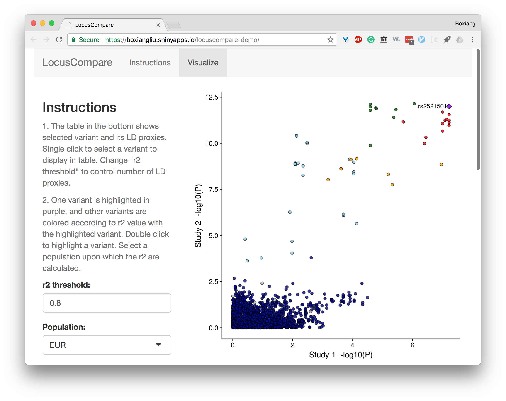

# LocusCompare

## Introduction
LocusCompare is an interactive visualization tool for comparing two genome-wide association datasets. For instance, it can be used to visualize the colocalization between a GWAS dataset to an eQTL dataset, which is particularly useful for fine-mapping studies. 

## Demo 

A demo version of LocusCompare can be accessed [here](https://boxiangliu.shinyapps.io/locuscompare-demo/), which should look something like this. 



This version uses pre-loaded dataset to demonstrate the usage of LocusCompare. To use your own dataset, proceed with installation. 


## Installation

Download this git repository.

```
git clone git@github.com:boxiangliu/locuscompare.git
```

## Usage
Open `locuscompare.R` and `server.R` in Rstudio, which is available for free [here](https://www.rstudio.com/products/rstudio/download/#download).

In `locuscompare.R`, change the path to `tabix`, `bgzip`, and `plink`. Both `tabix` and `bgzip` are part of `htslib`, which can be download [here](http://www.htslib.org/download/); `plink` can be downloaded [here](https://www.cog-genomics.org/plink2).

In `server.R`, change the path to `in_fn1` and `in_fn2`. These two files should be tab-delimited and contain summary statistics for two GWAS studies. Each file should have the following four columns:

1. rsid
2. chr
3. pos
4. pval 

You can download an example GWAS data [here](https://drive.google.com/uc?export=download&id=19mX451Pt5UCR-ShYM_oWflPsjvaUfqGS) and a eQTL data [here](https://drive.google.com/uc?export=download&id=16xI9WO2EjU4j8e3ARAZYpODCUD6ud9SN) as inputs to `in_fn1` and `in_fn2`.

With `server.R` open, click on "Run App" on the topright corner of the text editor to bring up `LocusCompare`.  

## Questions

For questions and bug reports, please open an issue [here](https://github.com/boxiangliu/locuscompare/issues). 

