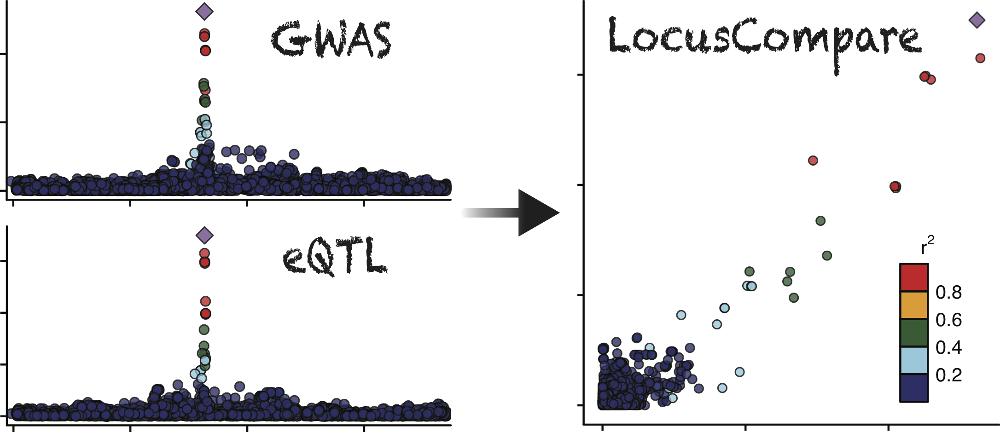

# LocusCompare: Visualizing the colocalization of association summary statistics 

---
## Introduction

LocusCompare is a suite of tools and datasets to visualize the colocalization of summary statistics from pairs of association datasets (e.g. GWAS and eQTL). These tools and datasets inclue: 

- Colocalization statistics between more than 200 GWAS and 48 GTEx (version 7) tissues
- Interactive LocusCompare plot to visualize a single locus
- Bash script to download summary statistics of more than 200 GWAS

## Documentations
For instructions please follow these links: 

- Documentation:
<a href="http://www.google.com/" target="_blank">Hello, world!</a>

<https://www.github.com/boxiangliu/locuscompare/wiki>
- Frequently Asked Questions: <https://www.github.com/boxiangliu/locuscompare/wiki/FAQ>
- Bug reports: <https://www.github.com/boxiangliu/locuscompare/issues>

To download stand-alone version:

- [LocusCompareR](https://www.github.com/boxiangliu/locuscomparer)

## License
GPL v3 or later

## Developers
- Boxiang Liu (author, maintainer)
- Mike Gloudemans (author, maintainer)
- Stephen Montgomery (author)
